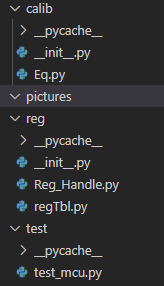

# mcu

---
## 1. 代码结构

```plaintext
Project/
|---calib                   存放各个校准模块类
|   |---Eq.py               此处示例了一个均衡模块
|
|---reg                     存放与寄存器相关文件
|   |---Reg_Handle.py       寄存器读写
|   |---regTbl.py           用于描述寄存器表单，并对每个32bit的寄存器进行位域定义
|
|---test                    对各模块或者流程就行脚本测试
    |---test_mcu.py
```

---
## 2. 寄存器读写规则
- 寄存器读
    ```python
    handle.read_reg(配置项名)
    #配置项名即为表单上的名字
    ```
- 寄存器写
     ```python
    handle.write_reg(配置项名，配置项值)
    #配置项名即为表单上的名字
    ```


